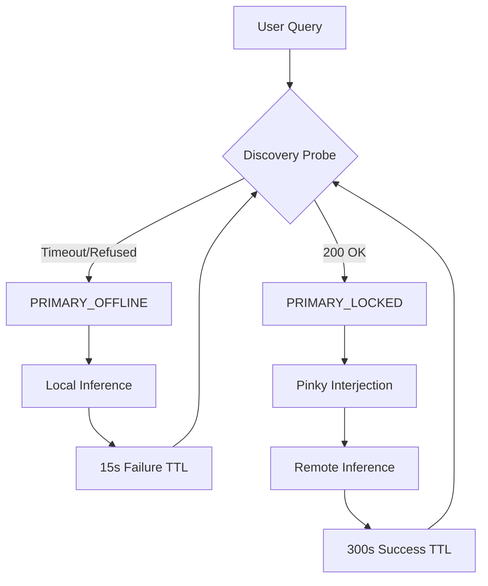

# Federated Architecture State Machine
**Role: [SPEC] - Latency & Residency Governance**

This document defines the logical transitions of the Acme Lab between the **Local Hemisphere (2080 Ti)** and the **Sovereign Hemisphere (4090)**. It codifies the "Authority of Time" rule to prevent premature fallbacks.

---

## 🚦 Connectivity States

### 1. PRIMARY_OFFLINE
*   **Trigger**: Network timeout (>15s) or `Connection Refused` during discovery.
*   **Behavior**: System immediately shunts all reasoning to the **Unified 3B Base (Local)**.
*   **Cooldown**: 15s (Asymmetric TTL). Re-probe frequently.

### 2. PRIMARY_LOCKED (The Long-Tail)
*   **Trigger**: API is responsive (`/api/tags` returns 200 OK), but generation is pending.
*   **Behavior**: 
    *   **Trust**: System yields to the remote host for up to 180s.
    *   **Airtime**: The Hub **MUST** trigger a Pinky interjection ([FEAT-172]) to buy time.
    *   **Suppression**: The Fidelity Pivot (Agentic-R) is suppressed for the first 60s.
*   **Cooldown**: 300s (Success Cache). Maintain connection persistence.

---

## 🔄 Transition Logic

---

## 🛡️ The "Authority of Time" Protocol
1.  **Presence is Truth**: If the Windows API responds to a ping, the hardware is considered **RESIDENT**. 
2.  **No Panic Pivots**: Do not fall back to local models just because the remote host is slow. A slow response from a 27B model is higher-value than a fast response from a 3B model.
3.  **Mandatory Interjection**: If the state is `PRIMARY_LOCKED`, the Hub is forbidden from "silence." It must leverage the bicameral intuition (Pinky) to provide immediate feedback.

---
**"A slow truth is better than a fast hallucination."**
